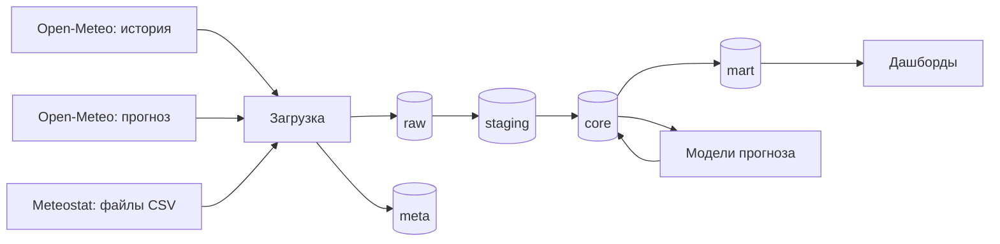

# Мониторинг погодных условий в Москве

Проектная работа по дисциплине «Прогнозно-аналитические системы» (РТУ МИРЭА, профиль «Управление данными»).

Система собирает данные о погоде в Москве из открытых источников и хранит их в PostgreSQL по слоям.
На следующих этапах по этим данным будет строиться прогноз среднесуточной температуры, а результаты
будут выводиться на дашборды.

## Задача

Пользователь — специалист ЖКХ (управляющая компания или ресурсоснабжающая организация).

Прогнозируемый показатель — среднесуточная температура воздуха на 1–7 дней вперёд
(метеостанция Москва, ВДНХ, индекс ВМО 27612).

Для чего нужен прогноз:

- отопление включают после 5 дней подряд со среднесуточной температурой ниже +8 °C
  (п. 5 Правил предоставления коммунальных услуг, Постановление Правительства РФ № 354);
- переход температуры через 0 °C — риск гололёда, нужна противогололёдная обработка.

## Источники данных

1. **Open-Meteo Historical Weather API** — история погоды с 1991 года: температура, осадки, снег,
   ветер, давление, влажность, облачность. Получение через API, формат JSON.
2. **Open-Meteo Forecast API** — прогноз на 7 дней. Сохраняется раз в день, чтобы потом сравнить
   свой прогноз с прогнозом погодных моделей. Получение через API, формат JSON.
3. **Meteostat** — суточные данные станции ВДНХ. Скачиваются файлы, по одному на год, формат CSV.gz.

Данные открытые, лицензия CC BY 4.0. Источники: Open-Meteo.com, Meteostat (первичные данные NOAA и DWD).

Что пришлось учесть:

- Open-Meteo отдаёт историю по вчерашний день, но последние дни потом уточняются. Поэтому при каждой
  загрузке последние 10 дней запрашиваются ещё раз.
- В файле Meteostat за текущий год есть строки на несколько дней вперёд — это не наблюдения, а прогноз
  модели DWD MOSMIX. В базу файл сохраняется целиком, но такие дни не считаются загруженными.
- В файлах Meteostat за разные годы разный набор колонок, поэтому файл читается по заголовку.

## Архитектура



Слои — это отдельные схемы в PostgreSQL:

- `raw` — данные в том виде, в каком пришли из источника;
- `staging` — данные из raw, разобранные по колонкам, с правильными типами и единицами измерения;
- `core` — справочники (даты, станции, коды погоды), сведённые данные по дням с историей
  изменений, прогнозы;
- `mart` — витрины для дашбордов и моделей: погода по дням с нормой и признаками для решений,
  последний прогноз;
- `meta` — служебные таблицы: миграции, журналы загрузок и преобразований, отметки загрузки.

Структура базы меняется только через миграции (`sql/migrations`). Применённые миграции записываются
в `meta.schema_migrations`, повторно они не выполняются.

## Как устроена загрузка

- **Инкрементальная загрузка.** В `meta.watermark` хранится дата, до которой данные источника уже
  загружены. Первый запуск загружает всю историю, следующие — только новые дни. Файл Meteostat
  скачивается заново, только если он изменился (проверка по ETag).
- **Идемпотентность.** Одни и те же данные нельзя записать в `raw` два раза (уникальный ключ по хешу
  содержимого). Если запустить загрузку повторно в тот же день, в базе ничего не изменится.
- **Устойчивость к сбоям.** У запросов есть таймаут. Если источник не ответил или вернул ошибку 5xx/429,
  запрос повторяется до 5 раз с увеличивающейся паузой. Если упал один источник, остальные всё равно
  загружаются. Если загрузка оборвалась на середине, следующий запуск продолжит с того же места.
- **Журнал загрузок.** В `meta.load_log` записывается каждая загрузка: источник, период, статус,
  количество запросов и повторов, сколько данных пришло новых и без изменений, текст ошибки.

## Как устроена обработка

Обработка — это SQL-файлы в `sql/transform`, они выполняются по порядку
(`python -m weather transform`). Все шаги идут в одной транзакции: если какой-то шаг упал,
база остаётся как была. Каждый шаг записывается в журнал `meta.transform_step`.

1. **staging.** Ответы Open-Meteo разбираются из JSON, файлы Meteostat — из CSV (по названиям колонок).
   Единицы приводятся к одним: ветер из км/ч в м/с, снег в см. Если день есть в нескольких ответах,
   берётся самый свежий. Будущие дни из файла Meteostat (прогноз модели) отбрасываются.
2. **Сведение источников.** На один день получается одна запись (`core.fact_weather_daily`):
   - температура берётся со станции (Meteostat), если там есть наблюдение;
   - если наблюдения нет, берётся Open-Meteo с поправкой на смещение (см. ниже);
   - осадки — со станции, если есть, иначе из Open-Meteo;
   - остальное (ветер, давление, облачность, снег) — из Open-Meteo.
3. **История изменений.** Если источник уточнил данные за день, старая запись не удаляется,
   а закрывается (`valid_to`, `is_current = false`), и добавляется новая. Так видно, что и когда
   поменялось.
4. **Справочники:** календарь `core.dim_date`, станция `core.dim_station` (из настроек), коды погоды
   ВМО `core.dim_weather_code` (в том числе признак переохлаждённых осадков).
5. **Витрины:**
   - `mart.climate_norm` — климатическая норма для каждого дня года (среднее за 1991–2020, окно ±7 дней);
   - `mart.weather_daily` — погода по дням: отклонение от нормы, сколько дней подряд ниже +8 °C,
     выполнено ли условие начала отопления (5 дней подряд), переход через 0 °C и риск гололёда;
   - `mart.forecast_latest` — последний прогноз на неделю с теми же признаками; серия холодных
     дней продолжает фактическую.

Что выяснилось по данным:

- У станции нет наблюдения за 875 дней из 13 тысяч: в основном это пропуски 2014–2019 годов,
  плюс несколько десятков дней, где Meteostat записал только значение модели. Эти дни заполняются
  из Open-Meteo.
- Станция ВДНХ теплее, чем точка сетки Open-Meteo: с декабря по апрель на 1–2 °C, летом почти
  не отличается (город теплее окрестностей). Поэтому при заполнении пропусков к Open-Meteo
  добавляется среднее смещение за этот месяц (`core.source_bias_monthly`, считается за 1991–2024).
  Та же поправка добавляется к прогнозу Open-Meteo.

## Технологии

Python 3.12, PostgreSQL 16, Docker Compose, библиотеки requests, psycopg, PyYAML, тесты на pytest.

## Как запустить

Нужны Git и Docker Desktop.

```bash
git clone https://github.com/PurpurSmagic/moscow-weather-forecast.git
cd moscow-weather-forecast
docker compose up --build
```

Будут запущены база данных и приложение: применятся миграции, загрузятся и обработаются данные.
Первый запуск загружает историю с 1991 года, это примерно 7 минут. Дальше всё занимает
несколько секунд.

Файл `.env` создавать не обязательно, без него используются значения по умолчанию. Если нужно
поменять пароль или порт, скопируйте `.env.example` в `.env` и измените значения.

Другие команды:

```bash
docker compose run --rm app python -m weather run      # загрузить и обработать новые данные
docker compose run --rm app python -m weather show     # погода за неделю, прогноз, отопление и гололёд
docker compose run --rm app python -m weather ingest   # только загрузить
docker compose run --rm app python -m weather transform  # только обработать
docker compose run --rm app python -m weather loads    # журнал загрузок и преобразований
docker compose run --rm app python -m weather check    # проверить, что всё работает
docker compose run --rm app pytest                     # тесты
```

База доступна с компьютера на порту 5433 (логин и пароль — в `.env.example`).

## Настройки

- `.env` — подключение к базе данных;
- `config/settings.yaml` — станция, с какого года загружать историю, пороги для отопления
  и гололёда, период нормы, параметры источников, таймауты и количество повторов запросов.

## Структура проекта

```text
config/settings.yaml   настройки
sql/migrations/        миграции базы данных
sql/transform/         обработка данных: raw -> staging -> core -> mart
src/weather/           код
  cli.py               команды (run, ingest, transform, show, loads, check, migrate)
  config.py            чтение настроек
  migrations.py        применение миграций
  http_client.py       запросы к источникам с повторами
  ingest/              загрузка данных из источников
  transform.py         запуск обработки
tests/                 тесты
```

## Ход работы

- [x] Этап 1. Каркас проекта: Docker, настройки, слои в базе, миграции
- [x] Этап 2. Загрузка данных из источников
- [x] Этап 3. Обработка данных (staging, core, mart)
- [ ] Этап 4. Проверки качества данных
- [ ] Этап 5. Модели прогноза
- [ ] Этап 6. Дашборды
- [ ] Этап 7. Происхождение данных, запуск по расписанию
- [ ] Этап 8. Отчёт и презентация
