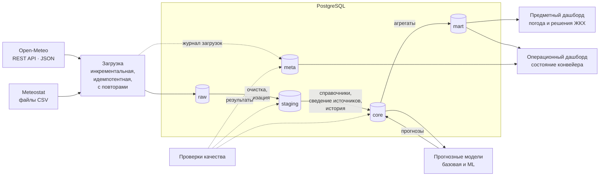

# Мониторинг погодных условий в Москве

Прогнозно-аналитическая система: сбор данных о погоде из нескольких открытых источников,
многослойное хранение, контроль качества, прогноз среднесуточной температуры воздуха
и дашборды для принятия решений.

Проектная работа по дисциплине «Прогнозно-аналитические системы»,
профиль «Управление данными», РТУ МИРЭА.

## Постановка задачи

| | |
|---|---|
| **Пользователь** | Специалист службы ЖКХ (управляющая или ресурсоснабжающая организация) |
| **Прогнозируемый показатель** | Среднесуточная температура воздуха, °C, на 1–7 суток вперёд (метеостанция Москва, ВДНХ, индекс ВМО 27612) |
| **Решения, которые поддерживает система** | **Начало и окончание отопительного периода.** По п. 5 Правил предоставления коммунальных услуг (Постановление Правительства РФ № 354) отопление включают после 5 суток подряд со среднесуточной температурой ниже +8 °C.<br>**Риск гололёда.** Переход температуры через 0 °C сигнализирует о необходимости противогололёдной обработки. |

## Архитектура

Целевая схема системы (дорабатывается по ходу этапов):



### Слои хранения

Каждый слой — отдельная схема PostgreSQL; назначение слоя записано в комментарии к схеме
(видно в базе командой `\dn+`).

| Слой | Что хранит | Ответственность |
|---|---|---|
| `raw` | Ответы источников как есть (JSON, CSV) + отметка загрузки | Неизменяемая копия: можно переобработать данные без повторного обращения к источнику |
| `staging` | Типизированные данные: единые единицы (°C, мм, м/с, гПа), время в UTC, без дублей | Очистка; строки, не прошедшие проверки, уходят в карантин |
| `core` | Справочники (станции, источники, даты, погодные явления), факты наблюдений и прогнозов | Единая модель данных и история изменений |
| `mart` | Витрины под вопросы пользователя | Источник данных для дашбордов и моделей |
| `meta` | Миграции схемы, журнал загрузок, отметки инкрементальной загрузки, результаты проверок | Служебные метаданные |

### Управление схемой БД

Структура базы меняется только миграциями — файлами `sql/migrations/VNNN__описание.sql`.
Команда `python -m weather migrate` применяет новые файлы и записывает их в
`meta.schema_migrations` с контрольной суммой SHA-256. Повторный запуск ничего не меняет,
а правка уже применённой миграции обнаруживается и останавливает запуск.

## Технологический стек

| Компонент | Выбор | Почему |
|---|---|---|
| Язык | Python 3.12 | Единый язык для загрузки, обработки и моделей |
| Хранилище | PostgreSQL 16 | Схемы для слоёв, транзакционные миграции, JSONB для сырых ответов |
| Развёртывание | Docker Compose | Система поднимается одной командой на любой ОС |
| Конфигурация | `config/settings.yaml` + переменные окружения (`.env`) | Параметры предметной области отдельно от секретов |
| Тесты и стиль | pytest, ruff | |

Компоненты следующих этапов (модели, дашборды, оркестрация) будут добавлены в таблицу по мере реализации.

## Быстрый старт

Нужны **Git** и **Docker Desktop** (Windows/macOS) или Docker Engine с Compose v2 (Linux).

```bash
git clone https://github.com/PurpurSmagic/moscow-weather-forecast.git
cd moscow-weather-forecast
cp .env.example .env            # Windows PowerShell: Copy-Item .env.example .env
docker compose up --build
```

Compose поднимет PostgreSQL, применит миграции и выполнит проверку системы.
Ожидаемый результат в конце вывода:

```text
Слои хранения:
  [ ok] raw      — ответы источников без изменений
  [ ok] staging  — очищенные и типизированные данные
  [ ok] core     — единая модель данных: справочники, факты, история
  [ ok] mart     — витрины для дашбордов и моделей
  [ ok] meta     — служебные метаданные
Миграции: применено 1, ожидают 0
Итог: система готова к работе
```

База остаётся запущенной и доступна с компьютера на порту `5433`
(пользователь, пароль и имя БД — из `.env`). Остановить: `docker compose down`;
удалить вместе с данными: `docker compose down -v`.

### Команды

| Команда | Что делает |
|---|---|
| `docker compose run --rm app python -m weather migrate` | Применить новые миграции схемы БД |
| `docker compose run --rm app python -m weather check` | Проверить настройки, подключение, слои и миграции |
| `docker compose run --rm app pytest` | Запустить тесты |

### Запуск без Docker (для разработки)

```bash
python -m venv .venv && source .venv/bin/activate   # Windows: .venv\Scripts\activate
pip install -r requirements.txt -r requirements-dev.txt
docker compose up -d db                              # только база
PYTHONPATH=src python -m weather migrate             # Windows: $env:PYTHONPATH="src"
pytest
```

## Конфигурация

| Где | Что |
|---|---|
| `.env` (шаблон — `.env.example`) | Подключение к PostgreSQL, уровень логирования, путь к файлу настроек |
| `config/settings.yaml` | Метеостанция, начало истории, горизонт прогноза, пороги решений (отопление, гололёд) |

## Структура репозитория

```text
├── config/settings.yaml      настройки предметной области
├── sql/migrations/           миграции схемы БД (VNNN__описание.sql)
├── src/weather/              код системы
│   ├── cli.py                команды: migrate, check
│   ├── config.py             загрузка и проверка настроек
│   ├── db.py                 подключение к PostgreSQL
│   └── migrations.py         применение миграций
├── tests/                    тесты
├── Dockerfile
└── docker-compose.yml
```

## Ход работы

- [x] **Этап 1.** Каркас: Docker, конфигурация, слои хранения, миграции схемы
- [ ] **Этап 2.** Загрузка данных: источники, журнал загрузок, инкрементальность, устойчивость к сбоям
- [ ] **Этап 3.** Обработка: staging → core → mart, справочники, сведение источников, историзация
- [ ] **Этап 4.** Контроль качества данных
- [ ] **Этап 5.** Прогнозные модели и валидация
- [ ] **Этап 6.** Дашборды: предметный и операционный
- [ ] **Этап 7.** Происхождение данных и запуск по расписанию
- [ ] **Этап 8.** Отчёт и презентация
